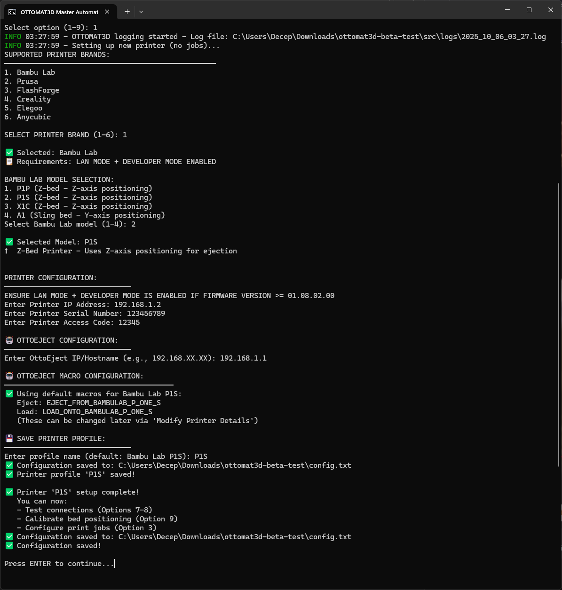

# OTTOMAT3D Repository Setup - Progress Summary

**Date:** October 7, 2025  
**Project:** OTTOMAT3D Master Beta Script Portfolio Repository  
**Location:** `/Users/harshilpatel/Desktop/Projects/MCP/ottostudio/__beta_testing`

---

## Current Status: 50% Complete

### ✅ What Has Been Completed

1. **Screenshots Added** ✅
   - User manually copied screenshots from `/Users/harshilpatel/Desktop/Projects/MCP/screenshots` to `/Users/harshilpatel/Desktop/Projects/MCP/ottostudio/__beta_testing/docs/screenshots/`
   - Files copied:
     - `main_menu.png`
     - `printer_selection.png`
     - `profile_selection.png`
     - `job_setup_and_rack_validation.png` (combined screenshot)
     - `Automation_sequence.jpeg`
     - `Ottomat3d-Logo.png`

2. **Directory Structure** ✅
   - Created `/docs/` directory
   - Created `/docs/screenshots/` directory

3. **Documentation Files Created** ✅
   - `docs/USER_GUIDE.md` - Complete beta testing user manual

---

## ⚠️ What Still Needs To Be Done

### 1. Create Remaining Documentation Files

Need to create these files in order:

**Root Directory:**
- `.gitignore` - Python, macOS, build artifacts
- `LICENSE` - Portfolio demonstration license (MIT-based with restrictions)
- `README.md` - Portfolio-focused technical showcase (replace current beta testing README)
- `ARCHITECTURE.md` - Deep technical documentation
- `build_and_sign_SANITIZED.sh` - Sanitized build script (or replace existing)

**docs/ Directory:**
- `docs/WINDOWS_SETUP.md` - Condensed from PDF
- `docs/MACOS_SETUP.md` - Condensed from PDF

### 2. Handle Existing Files

**Current README.md:**
- The file at `/Users/harshilpatel/Desktop/Projects/MCP/ottostudio/__beta_testing/README.md` is the **original beta testing README**
- This needs to be REPLACED with the new portfolio-focused README
- The original content has been preserved in `docs/USER_GUIDE.md`

**Current build_and_sign.sh:**
- Contains personal information:
  - Apple Developer ID: "Developer ID Application: Harshil Patel (VG4BA3XSGG)"
  - Site-packages path
  - Team ID
- Needs to be replaced with sanitized version

**Existing LICENSE.md:**
- An original `LICENSE.md` exists (proprietary beta testing license)
- We're creating a new `LICENSE` for portfolio purposes
- Decision needed: Keep both, or rename original to `LICENSE_ORIGINAL.md`?

### 3. Update README Screenshot References

The new README.md will have these placeholder references that need actual screenshot paths:

```markdown




  <!-- MISSING - need to create this -->
```

**Missing Screenshot:**
- `macos_app.png` - Need screenshot of the macOS .app icon or app launching

### 4. Git Repository Initialization

Once all files are created:

```bash
cd /Users/harshilpatel/Desktop/Projects/MCP/ottostudio/__beta_testing

# Initialize Git
git init

# Add all files
git add .

# Initial commit
git commit -m "Initial commit: OTTOMAT3D Master Beta Script portfolio showcase"
```

### 5. GitHub Repository Creation

- **Name:** `ottomat3d-master-beta-script`
- **Description:** "Cross-platform CLI automation script for multi-brand 3D printer control"
- **Visibility:** Public (portfolio showcase)
- **Topics:** `python`, `automation`, `3d-printing`, `iot`, `mqtt`, `websocket`, `pyinstaller`

---

## Important Notes & Decisions

### Files Organization

```
__beta_testing/
├── .gitignore                    ⚠️ NEEDS TO BE CREATED
├── LICENSE                       ⚠️ NEEDS TO BE CREATED
├── LICENSE.md                    ✅ EXISTS (original proprietary license)
├── README.md                     ⚠️ NEEDS TO BE REPLACED (currently beta testing version)
├── ARCHITECTURE.md               ⚠️ NEEDS TO BE CREATED
├── build_and_sign.sh             ⚠️ NEEDS TO BE REPLACED (has personal info)
├── docs/
│   ├── USER_GUIDE.md             ✅ CREATED
│   ├── WINDOWS_SETUP.md          ⚠️ NEEDS TO BE CREATED
│   ├── MACOS_SETUP.md            ⚠️ NEEDS TO BE CREATED
│   └── screenshots/              ✅ CREATED (6 files added by user)
└── src/                          ✅ EXISTS (all source code)
```

### Personal Information to Remove

From `build_and_sign.sh`:
- Developer ID: "Harshil Patel (VG4BA3XSGG)"
- Team ID: "VG4BA3XSGG"
- Site-packages path (local Python installation)

Replace with placeholders:
- `[YOUR_NAME]`
- `[YOUR_TEAM_ID]`
- `[YOUR_PYTHON_SITE_PACKAGES_PATH]`

### Screenshot Status

**Have:**
- ✅ main_menu.png
- ✅ printer_selection.png
- ✅ profile_selection.png
- ✅ job_setup_and_rack_validation.png
- ✅ Automation_sequence.jpeg
- ✅ Ottomat3d-Logo.png

**Missing:**
- ❌ macos_app.png (need screenshot of .app icon/launch)

---

## Next Steps for Next Claude Session

### Priority 1: Create Core Documentation

1. **Create `.gitignore`**
   - Python (*.pyc, __pycache__, venv, etc.)
   - macOS (.DS_Store, *.app)
   - Build artifacts (dist/, build/, *.spec)
   - Logs (*.log)
   - Sensitive files (config.json, *.key, .env)

2. **Create `LICENSE`**
   - Portfolio demonstration license
   - MIT-based with restrictions
   - Clear notice: for portfolio/technical review only
   - Restrict commercial use and redistribution

3. **Create new `README.md`**
   - Portfolio demonstration notice at top
   - Technical challenges & solutions
   - System architecture overview
   - Module breakdown
   - Key features with screenshots
   - Development timeline
   - Installation instructions
   - Technical skills demonstrated
   - Known issues
   - Repository structure

4. **Create `ARCHITECTURE.md`**
   - System overview and architecture
   - Design patterns used
   - Module architecture breakdown
   - Configuration system details
   - Printer integration specifics
   - Build system explanation
   - Code signing process
   - Performance considerations

5. **Create `docs/WINDOWS_SETUP.md`**
   - System requirements
   - Firewall configuration
   - Installation steps
   - Troubleshooting
   - Third-party antivirus handling

6. **Create `docs/MACOS_SETUP.md`**
   - System requirements
   - Security bypass instructions
   - Installation steps
   - Troubleshooting
   - Firewall configuration

### Priority 2: Handle Build Script

**Option A:** Create sanitized version and replace
```bash
# Backup original
cp build_and_sign.sh build_and_sign_ORIGINAL.sh
# Create sanitized version (replace personal info)
```

**Option B:** Delete build_and_sign.sh and create new sanitized one

### Priority 3: Handle Original Files

**README.md:**
- Current file is beta testing guide
- Save as backup? (README_ORIGINAL.md)
- Replace with new portfolio-focused README

**LICENSE.md:**
- Keep both licenses?
- Rename original to LICENSE_ORIGINAL.md?

### Priority 4: Get Missing Screenshot

Need: `macos_app.png` - Screenshot of macOS .app icon

### Priority 5: Git & GitHub

Once all files created:
1. Initialize Git repo
2. Add all files
3. Commit with descriptive message
4. Create GitHub repository
5. Push to GitHub

---

## User Preferences & Instructions

From conversation:
1. **"DO NOT MAKE ASSUMPTIONS. ASK QUESTIONS IF YOU'RE UNSURE."**
2. **"DO NOT OVER-ENGINEER SOLUTIONS. DO EXACTLY AS YOU'RE TOLD."**
3. **"USE MCP TOOLS (FILESYSTEM, GIT, MEMORY, SEQUENTIAL THINKING)"**
4. **"BE CAREFUL NOT TO COMMIT TO DEVELOP BRANCH - USE FEATURE BRANCHES"**

User did NOT want:
- ❌ Shell scripts to move files (user can do it manually)
- ❌ Over-complicated solutions

---

## Questions for Next Claude

1. **README.md Backup:** Should we save the original beta testing README.md as README_ORIGINAL.md before replacing?

2. **LICENSE Files:** Keep both `LICENSE.md` (original) and `LICENSE` (new portfolio), or rename original to `LICENSE_ORIGINAL.md`?

3. **Build Script:** Should we create `build_and_sign_SANITIZED.sh` as a separate file, or replace the existing `build_and_sign.sh` directly?

4. **Missing Screenshot:** User needs to provide `macos_app.png` - should we proceed without it and add placeholder, or wait?

5. **PDF Files:** Should the original PDF guides (`OTTOeject - Stage 4 - Setup Script (Windows).pdf` and `OTTOeject - Stage 4 - Setup Script (MacOS).pdf`) be included in the repository, or kept separate to reduce repo size?

---

## Repository Goals (Recap)

1. ✅ Showcase technical skills in multi-brand API integration
2. ✅ Demonstrate cross-platform development expertise
3. ✅ Highlight software engineering patterns (Factory, Strategy, etc.)
4. ✅ Show build automation and distribution capabilities
5. ⚠️ Provide professional documentation (needs remaining files)
6. ⚠️ Make it GitHub-ready for portfolio (needs Git init)

---

## Estimated Time Remaining

- Create 6 documentation files: ~2 hours
- Sanitize build script: ~15 minutes
- Handle original files: ~15 minutes
- Git initialization: ~10 minutes
- GitHub setup and push: ~15 minutes

**Total:** ~3 hours of work

---

**Last Updated:** October 7, 2025, 3:15 PM  
**Next Action:** Create `.gitignore`, `LICENSE`, and new `README.md`
