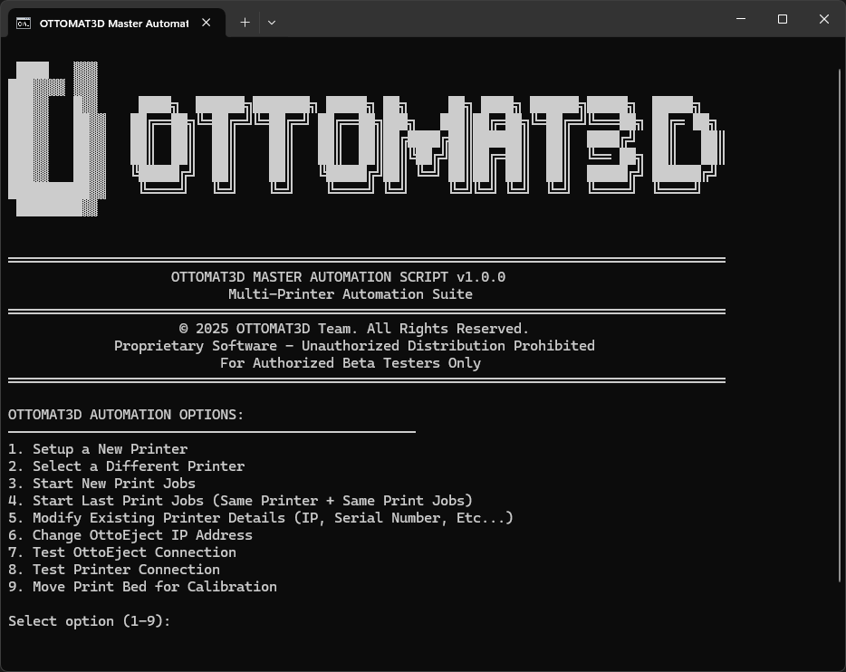
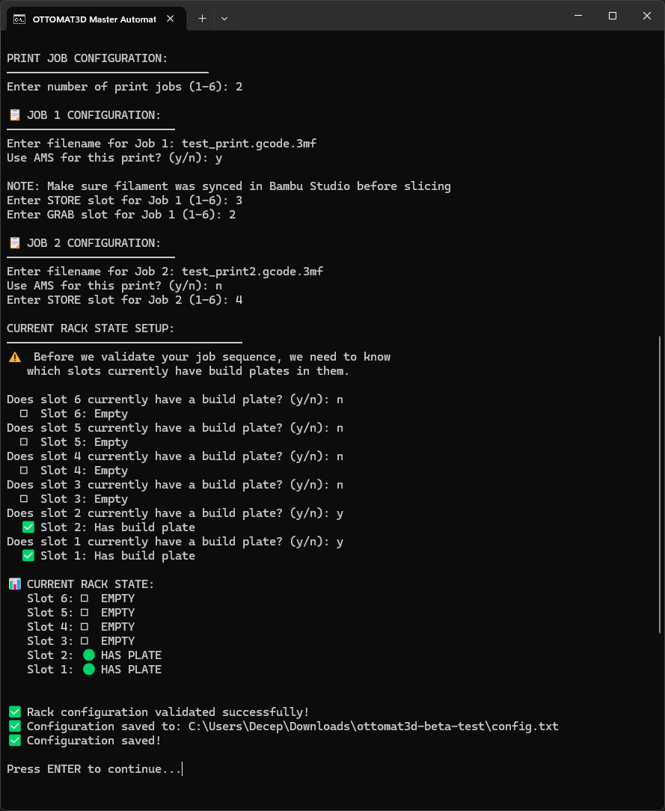
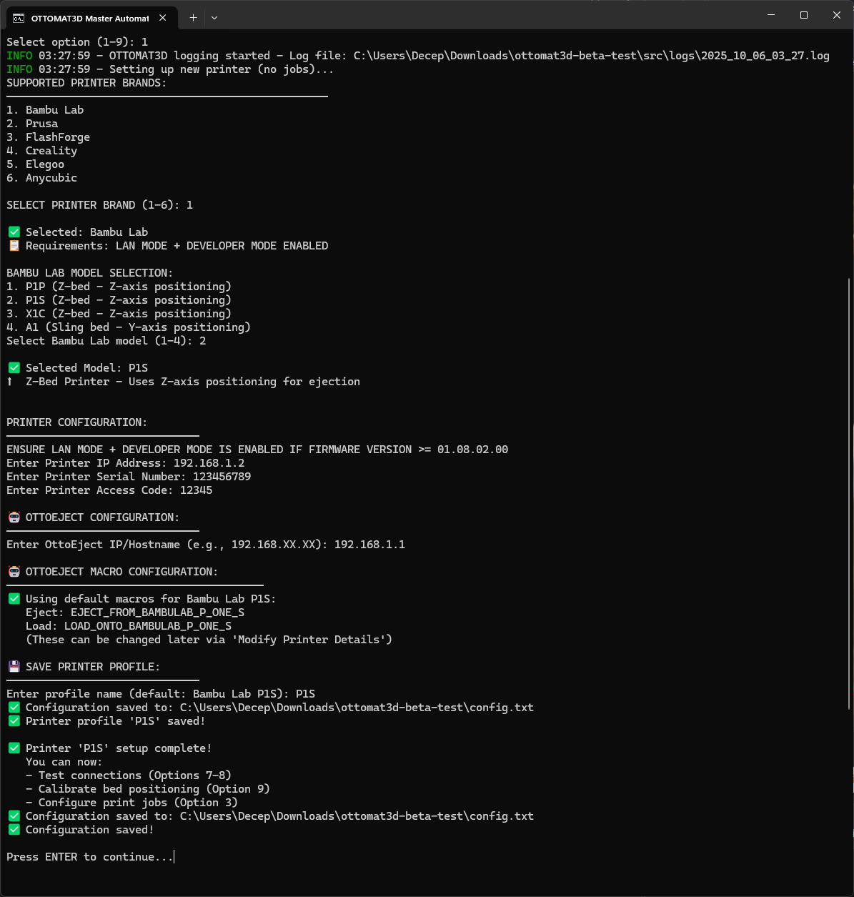
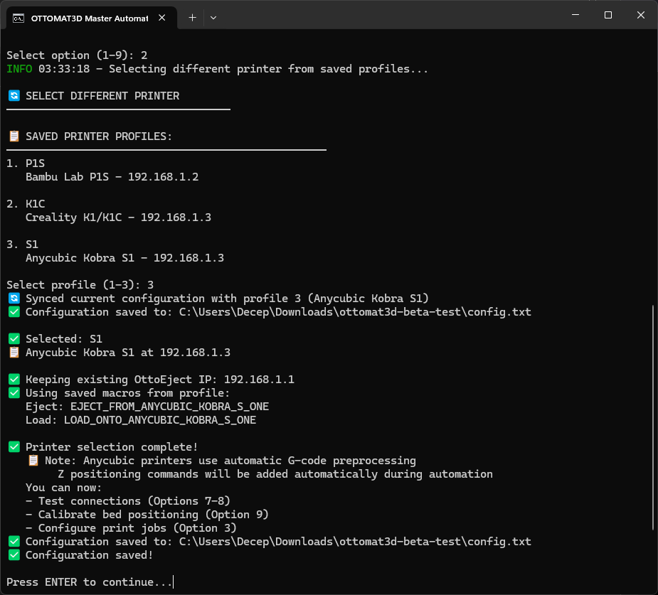

# OTTOMAT3D Master Automation Application

**Independent Development**: I designed and built this entire automation application from the ground up over a 2-month period for Ottomat3D's beta testing program. Every component - architecture, API integrations, build pipeline, and distribution system - was developed independently.



## What This Is

OTTOMAT3D is a cross-platform automation application that orchestrates 3D printer control across 6 different manufacturer APIs, coordinating with robotic ejection hardware to enable fully automated multi-job print workflows. This represents 88+ development conversations and approximately 300+ hours of work spanning July through September 2025.

This is not a simple script - it's a production-ready application with:
- Complete printer abstraction layer supporting 6 different communication protocols
- Self-contained Python runtime distribution (200MB+)
- Profile management system with persistent configuration
- Real-time status monitoring and error recovery
- Advanced features like AMS mapping and dynamic G-code modification
- Professionally signed and notarized macOS application
- Automated build and distribution pipeline

## Development Timeline

### Week 1-2 (Early July 2025): Foundation
- Built core automation orchestration engine
- Implemented printer setup wizard and configuration system
- Integrated 6 printer brands (Bambu Lab, Prusa, FlashForge, Creality, Elegoo, Anycubic)
- Created rack validation system to prevent storage slot conflicts
- Developed ejection sequence coordination with robotic hardware

**Technical Challenge**: Each printer uses completely different APIs - MQTT with certificates, HTTP with bearer tokens, WebSocket with custom firmware, dual HTTP+TCP connections. Had to design a Factory pattern that abstracts all of this behind a unified interface.

### Week 3 (Mid July): Advanced Features
- Implemented profile management system for multiple printer configurations
- Built dynamic G-code modification engine for Elegoo/Anycubic printers
- Solved bed-raising problem: printers have Z-height limits, but ejection robot needs bed raised. Solution: download G-code before each print, inject `G1 Z205 F600` movement command after print completion, re-upload modified file.

**Technical Breakthrough**: Discovered we could inject G-code commands dynamically. This eliminated the need for users to manually modify every print file.

### Week 4 (Late July): macOS Distribution Crisis
Initial approach used shell script wrapper, but macOS Gatekeeper blocked it. Every Python file triggered "unidentified developer" warnings. Having beta testers bypass security warnings for 20+ random files was unprofessional.

**Solution**: Pivoted to PyInstaller to create proper .app bundle with custom icon. This required learning PyInstaller configuration, handling hiddenimports, and bundling the entire Python 3.13 runtime.

### Week 1-2 (Early August): Code Signing Hell
Built .app successfully, but colleagues couldn't open it. Terminal would flash and close immediately. Spent 2 weeks debugging:
- Terminal wrapper issues
- Permissions problems  
- Gatekeeper blocking without clear error messages
- Learning about Apple's hardened runtime requirements

**Breakthrough**: Discovered the complete workflow requires Developer ID signing + notarization + stapling. Built automated `build_and_sign.sh` pipeline that handles everything.

### Week 3 (Mid August): AMS Implementation
Multi-material .3mf files from Bambu Studio wouldn't start printing. Spent a week implementing Bambu Lab's Automatic Material System (AMS) configuration.

Initial approach: tried to get user input for filament colors, material types, and slot mappings. Built color picker UIs, material selection menus. Very complex.

**Major Discovery**: The printer completely ignores the colors and materials sent via the API. It uses whatever filaments are physically loaded in the AMS. The mapping is just a formality to enable multi-material mode. 

This revelation simplified the entire feature from 20+ user inputs down to a single yes/no question: "Does this print use AMS?"

### Week 4 (Late August): Material Station + LeviQ
- Implemented FlashForge Material Station (similar to Bambu AMS but uses empty material mappings)
- Added Anycubic LeviQ full bed leveling sequence injection before each print
- Anycubic printers weren't doing complete leveling via script, had to reverse-engineer the LeviQ sequence

### Week 1 (Early September): Critical Bug Fixes
Final push before beta testing launch:

**Bug 1 - Bambu Connection Test**: Connection validation was failing. Root cause was in the bambulabs_api package itself. Had to fork and patch the package locally, then modify build_and_sign.sh to use local package instead of PyPI version.

**Bug 2 - Profile Switching**: Y-Sling printers (Bambu A1) move bed via Y-axis. Z-Bed printers (most others) move via Z-axis. Profile switching wasn't updating the movement commands. A P1P profile would try `Y200` movement (wrong), A1 profile would try `Z200` (also wrong). Fixed by regenerating bed movement commands on profile switch.

**Improvement**: Moved macOS config file from app bundle to `~/Library/Application Support/OTTOMAT3D/` (proper macOS convention).

### Week 2 (Mid September): Beta Launch
Shipped Windows and macOS versions to beta testers.

## Technical Architecture

### Multi-Protocol Printer Abstraction

```python
# Factory pattern creates appropriate printer instance
printer = PrinterFactory.create_printer(brand, config)

# Polymorphic interface works across all brands
printer.connect()
printer.start_print(filename, use_ams=True)
status = printer.get_status()
printer.disconnect()
```

Behind this simple interface:
- **Bambu Lab**: MQTT with X.509 certificates, JSON status messages, AMS slot mapping
- **Prusa**: REST API with bearer tokens, multipart file upload, PrusaLink integration
- **FlashForge**: Dual connection - HTTP for control + raw TCP socket for file transfer
- **Creality**: WebSocket with JSON-RPC, requires rooted firmware
- **Elegoo**: WebSocket with Moonraker API, Rinkhals custom firmware
- **Anycubic**: Moonraker REST API, Rinkhals firmware, LeviQ leveling injection

### Self-Contained Distribution

Challenge: Beta testers have different Python versions, missing dependencies, corporate firewalls blocking pip.

Solution: Bundle complete Python 3.13 runtime with all dependencies:
```
src/_internal/
├── python-3.13-mac/        # Complete Python interpreter
│   └── lib/python3.13/
│       └── site-packages/  # All dependencies pre-installed
└── python-3.13-windows/    # Windows equivalent
```

Result: 200MB download that works anywhere. No pip, no virtualenv, no system Python required.

### Dynamic G-code Modification

Elegoo and Anycubic printers have fixed Z-height ceilings. The ejection robot needs bed raised to Z205, but print files are already sliced with max Z180.

```python
def inject_bed_movement(self, gcode_path):
    # Download G-code from printer
    content = self.download_gcode(gcode_path)
    
    # Find print end marker
    lines = content.split('\n')
    end_index = self._find_print_end(lines)
    
    # Inject movement command
    lines.insert(end_index, "G1 Z205 F600 ; Raise bed for ejection")
    
    # Re-upload modified G-code
    self.upload_gcode(gcode_path, '\n'.join(lines))
```

For Anycubic, also inject complete LeviQ bed leveling sequence before print start.

### macOS Code Signing Pipeline

```bash
# build_and_sign.sh automates everything:

# 1. Build .app with PyInstaller
pyinstaller OTTOMAT3D-x86_64.spec

# 2. Sign with Developer ID
codesign --deep --force --options runtime \
    --sign "Developer ID Application: ..." \
    dist/OTTOMAT3D.app

# 3. Create DMG
hdiutil create -volname OTTOMAT3D \
    -srcfolder dist/OTTOMAT3D.app \
    -ov -format UDZO dist/OTTOMAT3D.dmg

# 4. Submit for Apple notarization
xcrun notarytool submit dist/OTTOMAT3D.dmg \
    --wait

# 5. Staple notarization ticket
xcrun stapler staple dist/OTTOMAT3D.app
```

Result: Properly signed macOS app that installs without any security warnings.

### AMS (Automatic Material System) Implementation

The breakthrough that simplified everything:

```python
# What I thought I needed:
ams_config = {
    'slots': [
        {'slot': 0, 'color': user_input_color_1, 'material': user_input_material_1},
        {'slot': 1, 'color': user_input_color_2, 'material': user_input_material_2},
        # ... complex user input collection
    ]
}

# What actually works:
ams_config = {
    'slots': [
        {'slot': 0, 'color': '808080', 'material': 'PETG'},  # Placeholder
        {'slot': 1, 'color': '000000', 'material': 'PETG'},  # Printer ignores
        {'slot': 2, 'color': 'FF0000', 'material': 'PETG'},  # these values
        {'slot': 3, 'color': '0000FF', 'material': 'PETG'},  # completely
    ]
}
```

The printer uses whatever filaments are physically loaded. The API configuration is just to enable multi-material mode. This reduced the feature from 20+ inputs to one yes/no question.

## Key Features

**Profile System**: Save multiple printer configurations. Switch between different printers or different configurations of the same printer instantly.

**Job Queue**: Configure multiple print jobs in advance. Application handles print → eject → store → load → next job automatically.

**Rack Validation**: Prevents conflicts by tracking storage slot assignments. Won't let you assign two jobs to the same slot.

**Real-Time Monitoring**: Status updates every 10 seconds during prints. Shows temperature, progress, time remaining, error states.

**Error Recovery**: Connection retry logic, timeout handling, graceful degradation if monitoring fails.

**Cross-Platform**: Single codebase works on Windows and macOS with platform-specific builds.



## System Requirements

**Windows**:
- Windows 10 or newer
- Windows Defender Firewall (or manual configuration for third-party antivirus)

**macOS**:
- macOS 11 (Big Sur) or newer
- Administrator access for security bypass

**Network**:
- All devices (computer, printer, OttoEject) on same local network
- 2.4GHz frequency recommended

## Installation

### Windows
1. Download `ottomat3d-beta-test-win64.zip`
2. Extract to desired location
3. Run firewall configuration scripts in `windows_setup/` folder
4. Double-click `run_ottomat3d.bat`

See [docs/WINDOWS_SETUP.md](docs/WINDOWS_SETUP.md) for detailed instructions.

### macOS
1. Download `ottomat3d-beta-test-macos.zip`
2. Extract and move to Applications or Desktop
3. Right-click OTTOMAT3D.app → Open (bypass Gatekeeper)
4. Go to System Settings → Privacy & Security → Click "Open Anyway"

See [docs/MACOS_SETUP.md](docs/MACOS_SETUP.md) for detailed instructions.

## Usage



First-time setup:
1. Launch application
2. Select Option 4: "Setup A New Printer"
3. Choose printer brand
4. Enter IP address and authentication details
5. Configure printer-specific settings (macros, AMS, bed type)
6. Configure print jobs (filenames, storage slots)
7. Validate rack state
8. Run automation



The application monitors print progress in real-time, coordinates with the ejection robot after each print, and automatically proceeds to the next job in the queue.


## Technical Skills Demonstrated

- **Software Architecture**: Factory pattern, Strategy pattern, Singleton pattern
- **API Integration**: REST, MQTT, WebSocket, TCP sockets - 6 different protocols
- **Network Programming**: Certificate-based auth, bearer tokens, connection pooling, retry logic
- **Cross-Platform Development**: Windows and macOS with platform-specific builds
- **Build Automation**: PyInstaller, code signing, notarization, DMG creation
- **CLI Design**: Menu system, real-time updates, input validation, error messages
- **Configuration Management**: INI-style config files, profile system, validation
- **Error Handling**: Graceful degradation, retry logic, user-friendly error messages
- **Testing**: Connection validation, integration testing with hardware
- **Documentation**: User guides, setup instructions, troubleshooting

## Project Structure

```
.
├── LICENSE                     # Portfolio demonstration license
├── README.md                   # This file
├── ARCHITECTURE.md             # Deep technical documentation
├── build_and_sign.sh           # macOS build pipeline (original)
├── build_and_sign_SANITIZED.sh # Sanitized version for portfolio
├── src/
│   ├── main.py                 # Application entry point
│   ├── config/                 # Configuration management
│   ├── setup/                  # Setup wizards
│   ├── operations/             # Automation logic
│   ├── printers/               # Printer integrations (6 brands)
│   ├── ottoeject/              # Robot hardware control
│   ├── utils/                  # Utilities (G-code, logging, rack management)
│   ├── ui/                     # CLI interface
│   └── gcode/                  # G-code templates
├── docs/
│   ├── USER_GUIDE.md           # Complete user manual
│   ├── WINDOWS_SETUP.md        # Windows installation guide
│   ├── MACOS_SETUP.md          # macOS installation guide
│   └── screenshots/            # Application screenshots
└── windows_setup/              # Windows firewall configuration scripts
```

## Known Limitations

- Bambu Lab MQTT connections can timeout (handled gracefully with reconnection)
- Creality printers require rooted firmware for WebSocket access
- Anycubic/Elegoo printers require Rinkhals custom firmware
- Windows requires firewall rules for printer communication
- macOS .app requires security bypass on first launch

## Future Enhancements

- Web-based UI for remote monitoring
- Support for additional printer brands
- Multiple simultaneous printer orchestration
- Advanced scheduling and queue management
- Real-time notifications via push/email
- Cloud storage for print history and analytics

## Repository Notes

This repository showcases the production application as deployed to beta testers. Personal information has been sanitized from build scripts (Developer ID, paths). The complete source code, build system, and documentation are included for technical review.

For questions about this project, contact Harshil Patel.

---

**Development Period**: July - September 2025  
**Total Conversations**: 88+ over 2 months  
**Lines of Code**: 5,000+ Python  
**Beta Testers**: Active testing program  
**Status**: Production deployment complete